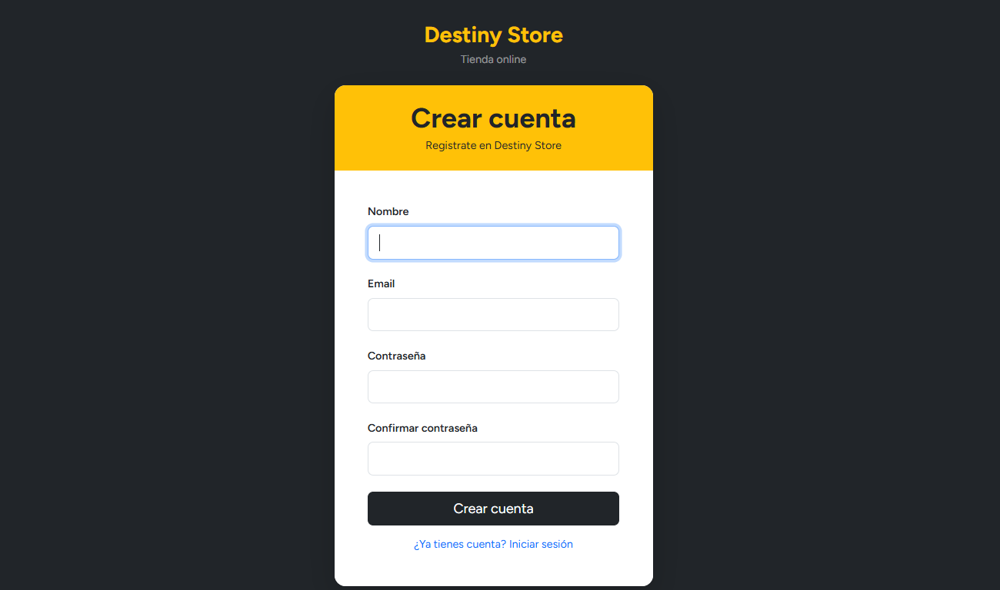
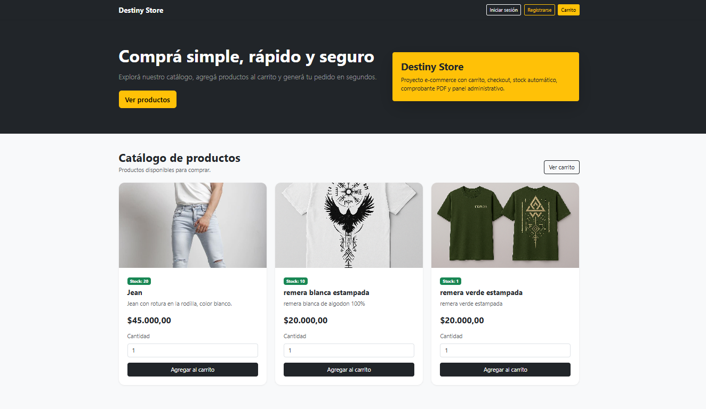
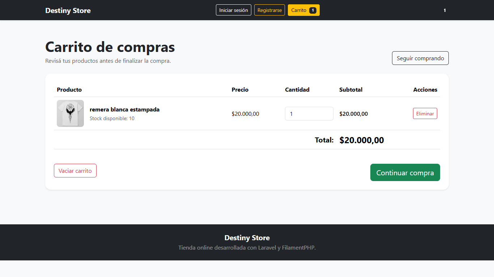
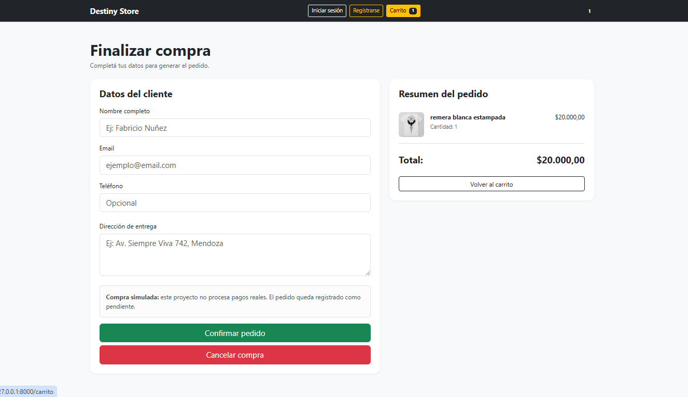
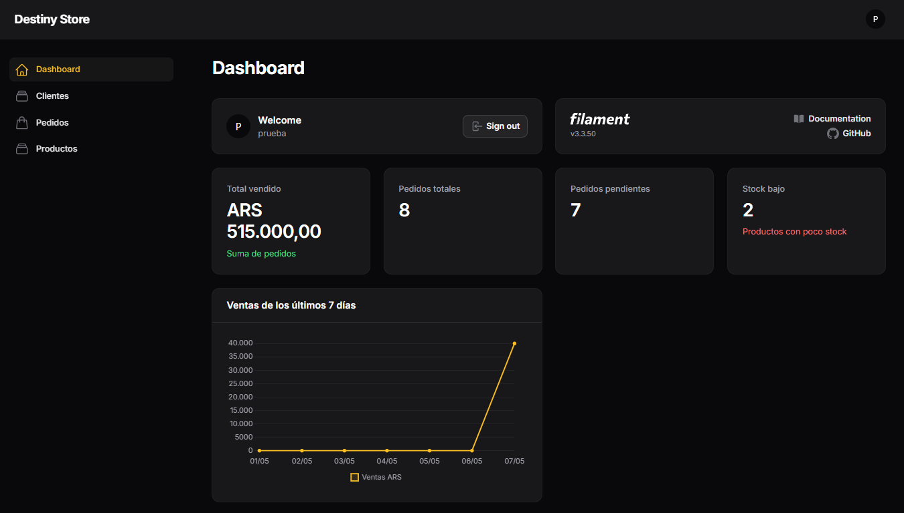
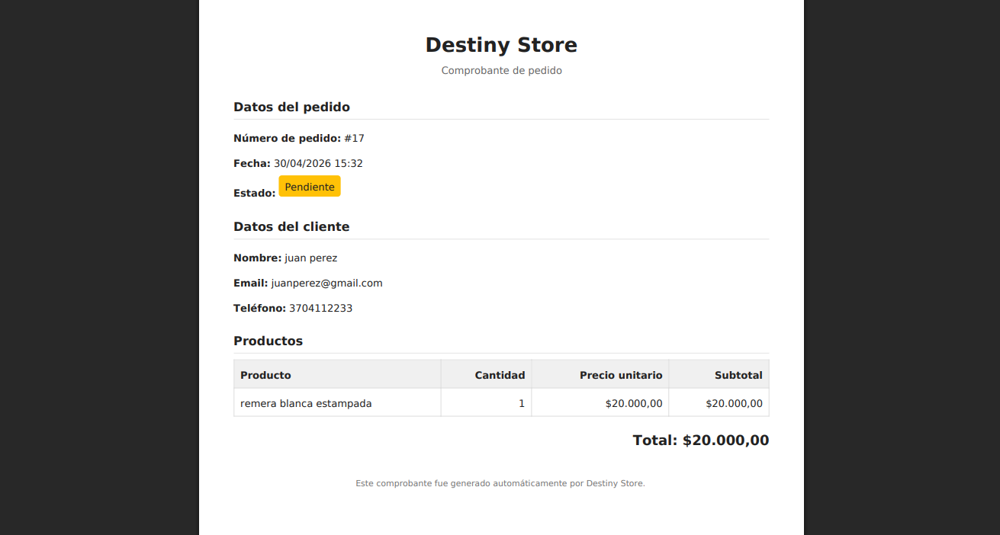

Destiny Store

Sistema de tienda online desarrollado con Laravel + FilamentPHP como proyecto de portfolio orientado a e-commerce real.

 Descripción.

Destiny Store es una aplicación web full stack que simula una tienda online completa, incluyendo:

* catálogo de productos
* carrito de compras
* checkout
* gestión de pedidos
* panel administrativo
* control de stock
* autenticación de usuarios
* generación de PDFs
* dashboard con métricas y gráficos

El objetivo del proyecto fue construir una aplicación funcional, moderna y escalable, enfocada tanto en experiencia de usuario como en lógica real de negocio.

 Tecnologías utilizadas

Backend

* PHP
* Laravel 12
* Eloquent ORM
* Laravel Breeze

Panel administrativo
* FilamentPHP v3

Frontend

* Blade
* Bootstrap 5
* TailwindCSS (base Laravel/Breeze)

Base de datos
* MySQL

Librerías adicionales
* barryvdh/laravel-dompdf

 Funcionalidades principales.
    Tienda online

* Catálogo público de productos
* Vista responsive
* Productos con imagen, precio y stock
* Carrito de compras dinámico
* Actualización automática de subtotales
* Checkout completo
* Validación de stock
* Dirección de entrega
* Cancelación de compra
* Registro e inicio de sesión personalizados

Gestión de pedidos

* Creación automática de pedidos
* Relación muchos a muchos entre pedidos y productos
* Cálculo automático de totales
Estados del pedido:
* Pendiente
* Pagado
* Entregado
* Cancelado
* Generación de comprobante PDF
* Restauración automática de stock al eliminar pedidos

Panel administrativo
Desarrollado con FilamentPHP.

Gestión de:
* Productos
* Clientes
* Pedidos

Funcionalidades:

* Dashboard administrativo
* Métricas de pedidos
* Tarjetas estadísticas
* Gráfico de ventas
* Gestión avanzada de productos por pedido
* Control de stock automático
* Protección por roles (is_admin) 

Sistema de autenticación
El sistema diferencia entre:

Usuario normal
* acceso a la tienda
* carrito
* checkout

Administrador
* acceso al panel /admin
Los usuarios normales no pueden acceder al panel administrativo.

Características técnicas destacadas

* Relaciones Eloquent (belongsToMany, pivots)
* Manejo de stock en tiempo real
* Validaciones backend
* Manejo de sesiones
* Generación de PDFs
* Arquitectura MVC
* Panel administrativo moderno
* Diseño responsive
* UX personalizada
* Separación de roles

Capturas

Login

  

Register

  

Catálogo

  

Carrito

  

Checkout

  

Dashboard

  

Comprobante pedido

  

Instalación:

Clonar repositorio
git clone https://github.com/FabricioNunez/Destiny_store.git

Entrar al proyecto
cd Destiny_store

Instalar dependencias
composer install
npm install

Configurar entorno
cp .env.example .env

Generar key
php artisan key:generate

Configurar base de datos
Editar .env

DB_DATABASE=destiny_store
DB_USERNAME=root
DB_PASSWORD=

Ejecutar migraciones
php artisan migrate

Crear enlace de storage
php artisan storage:link

Iniciar servidor
php artisan serve

Autor: Fabricio Nuñez

GitHub: FabricioNunez/Destiny_store
